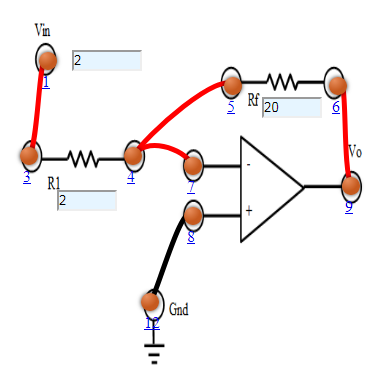

### Procedure

### Experiment
- Let us go through the experiment of Inverting Amplifier.
1. Connect the components as mentioned below:
L1-L3, L4-L7, L4-L5, L6-L9, L8-L12.(For eg. click on 1 and then drag to 3 and so on.)
2. Click on  'Check Connection' button to check the connections.
3. If connected wrong click on  'Delete all connection' button to erase all the connections.
4. Set the Resistance (R1) Value (1 Kohm - 50 Kohm).
5. Set the Feedback Resistance (Rf) Value (2 Kohm - 100 Kohm).
6. Set input voltage (Vin) (-15  to 15 V).
7. Now note the output voltage and click on 'Add to table' button.
8. Increase the input voltage by a factor of 2
9. Click on 'Plot' button to plot the output voltage vs input voltage.
10. Repeat the experiment for another set of resistance value. 
                                    

Figure:1

- Let us go through the experiment of  Non Inverting Amplifier.
1. Connect the components as mentioned below:
L1-L8, L4-L7, L4-L5, L6-L9, L3-L12.(For eg. click on 1 and then drag to 3 and so on.)
2. Click on  'Check Connection' button to check the connections.
3. If connected wrong click on  'Delete all connection' button to erase all the connections.	
4. Set the Resistance (R1) Value (1 Kohm - 50 Kohm).
5. Set the Feedback Resistance (Rf) Value (2 Kohm - 100 Kohm).
6. Set input voltage (Vin) (-15  to 15 V).
7. Now note the output voltage and click on 'Add to table' button.  
8. Increase the input voltage by a factor of 2.
9. Click on 'Plot' button to plot the output voltage vs input voltage.
10. Repeat the experiment for another set of resistance value.

Figure: 2

### Zener Characteristics
1. Select the diode
2. Set the rheostat Rh=1 Ω
3. By adjusting the rheostat, voltmeter reading is increased from 0 and in each time note the corresponding reading in milliammeter.
4. Take the readings and note Voltmeter reading across Zener diode and Ammeter reading.
5. Plot the V-I graph and observe the change.

Figure: 3

